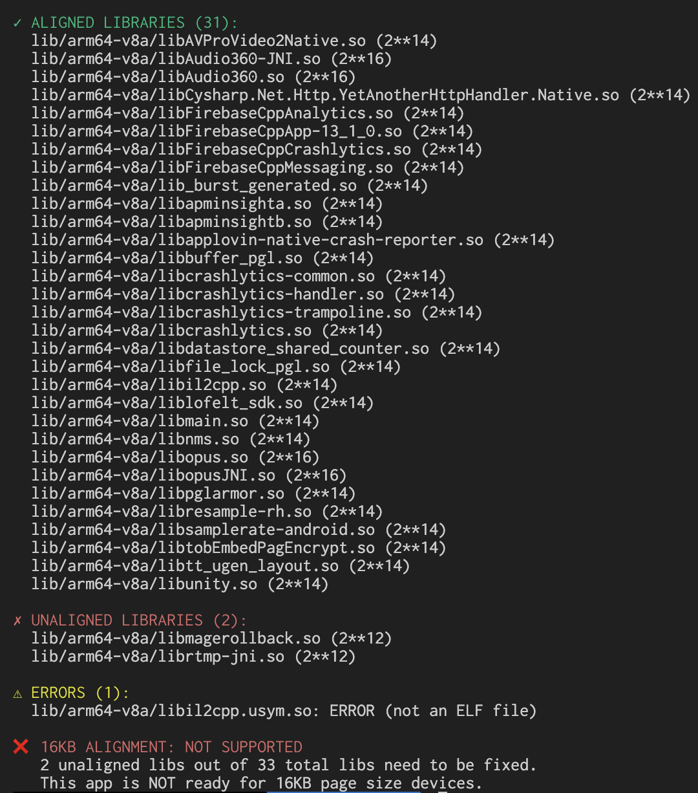

# is16kbReady

A Go CLI tool to check if your Android APK is ready for Google's 16KB page size requirement.

## Background

Starting **November 1, 2024**, Google Play Console requires all apps targeting Android 15 to support 16KB page sizes. This tool quickly analyzes your APK's native libraries (ARM64/x86_64) to verify ELF alignment compatibility.

## Installation

```bash
# Build from source
go build -o is16kbReady main.go

# Or use the build script for multiple platforms
./build.sh
```

## Usage

```bash
# Check your APK
./is16kbReady your-app.apk
```

## Example Output



The tool will show:
- ✅ **SUPPORTED**: All libraries are 16KB aligned
- ❌ **NOT SUPPORTED**: Some libraries need fixing
- ⚠️ **UNKNOWN**: No native libraries found

## What it checks

- Native libraries (.so files) in `lib/arm64-v8a/` and `lib/x86_64/`
- ELF LOAD segment alignment (must be ≥16KB)
- Provides clear compatibility status for 16KB page size devices
